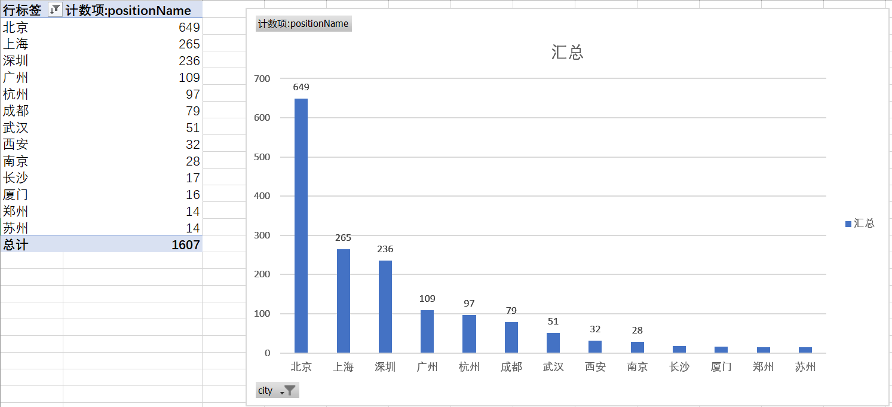
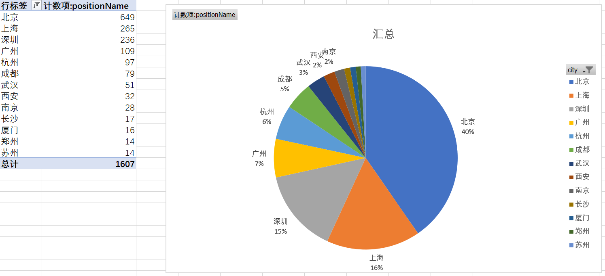
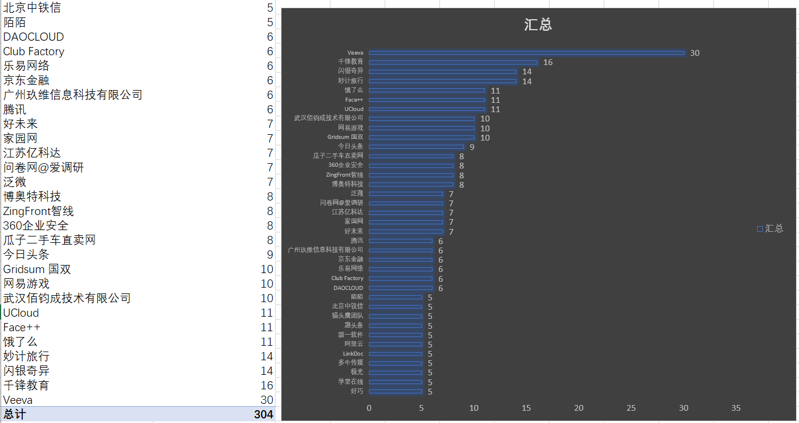
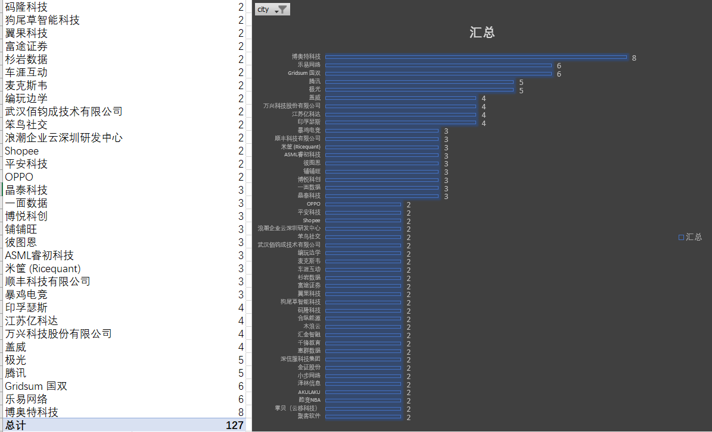
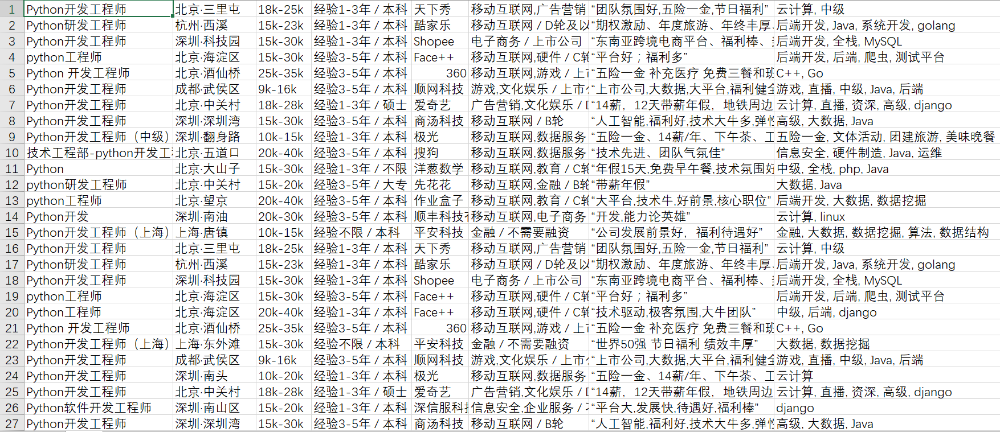

Scrapy Projects
=================
本项目为个人学习记录，会不定期~~挖坑~~更新

****
|工具|版本|
|---|---
|OS|Windows 10
|Python|3.6.4
|Scrapy|1.5.0
|Pycharm|2017.3.3
|Fiddler|v5.0.20173.50948
|Google Chrome|65.0.3325.146

****
|Author|SCUTJcfeng|
|---|---
|E-mail|jcfeng2013@gmail.com
|Blog|[blog.csdn.net/SCUTJcfeng](http://blog.csdn.net/SCUTJcfeng "CSDN博客")


****
## 项目目录
* [lagouJobs](#lagouJobs)
* [lagouPCJobs](#lagouPCJobs)

lagouJobs
------
本项目主要爬取[拉勾](http://m.lagou.com/search.html)移动版网页，因为移动版网页会直接返回Json文件:-)

由于是第一个项目，简单说明一下步骤：
1. 在命令行或Power shell输入```Scrapy startproject lagouJobs```，生产爬虫项目；
2. (可选)用Pycharm打开项目lagouJobs, 观察Fiddler抓包记录（或打开Chrome按F12进入开发者工具），观察得到的Json结构；
3. 确定Item值后，打开./lagouJobs/item.py，对要保留的字段给命个名（我保留以下7个字段信息）；
```
class LagoujobsItem(scrapy.Item):
    # define the fields for your item here like:
    # name = scrapy.Field()
    
    city = scrapy.Field()
    companyName = scrapy.Field()
    companyId = scrapy.Field()
    positionName = scrapy.Field()
    positionId = scrapy.Field()
    salary = scrapy.Field()
    companyFullName = scrapy.Field()

    pass
```
4. 在./lagouJobs/spiders/目录下建立新文件positionSpider.py，这个文件主要负责将我要爬的网页的信息提取出来传给Item，Item再传给下一个文件Pipeline;
  * URL格式如下，新的URL的话pageNo递增，city我选了全国，positionName我选了Python：
  ```
  url = 'http://m.lagou.com/search.json?%s&positionName=%s&pageNo=%d&pageSize=15' % 
  (self.city, self.positionName, self.pageNo)
  ```
5. 打开./lagouJobs/pipelines.py，这个文件负责处理Item信息，我这里就将Item信息输出到position.csv；
6. 数据简单分析。

为了数据分析方便，手动添加了7个字段对应的header，并重命名position.csv为position_Add_Header.csv，对总数1662个结果简单分析如下，分析用的Excel 2016：

|#|分析|图片|
|---|----|:---:|
|1|柱状图显示，以city划分，部分城市提供Python相关工作的数量小于10，故忽略，结果显示：前3名是北京、上海和深圳||
|2|饼图显示，前三名占了71%||
|3|按公司划分，Veeve一家公司就招30个与Python相关的岗位，厉害噢，差不多是第二名的2倍了||
|4|这个条状图显示的多一些||
|5|只保留深圳本地的，前3名是博奥特、乐易和国双||

lagouPCJobs
------
本项目主要通过Selenium + Chrome + Xpath 爬取拉勾网职位列表，结果同样输出到CSV文件。

Known Issue：
1. 会出现最后一页或者还不到最后一页时，停止翻页，但数据还在写入（endless），必须强制关闭程序，造成大量重复数据；
2. 数据未去重。

Todo：
1. 利用数据库去重；
2. 弄明白Issue 1.

贴个图吧：

